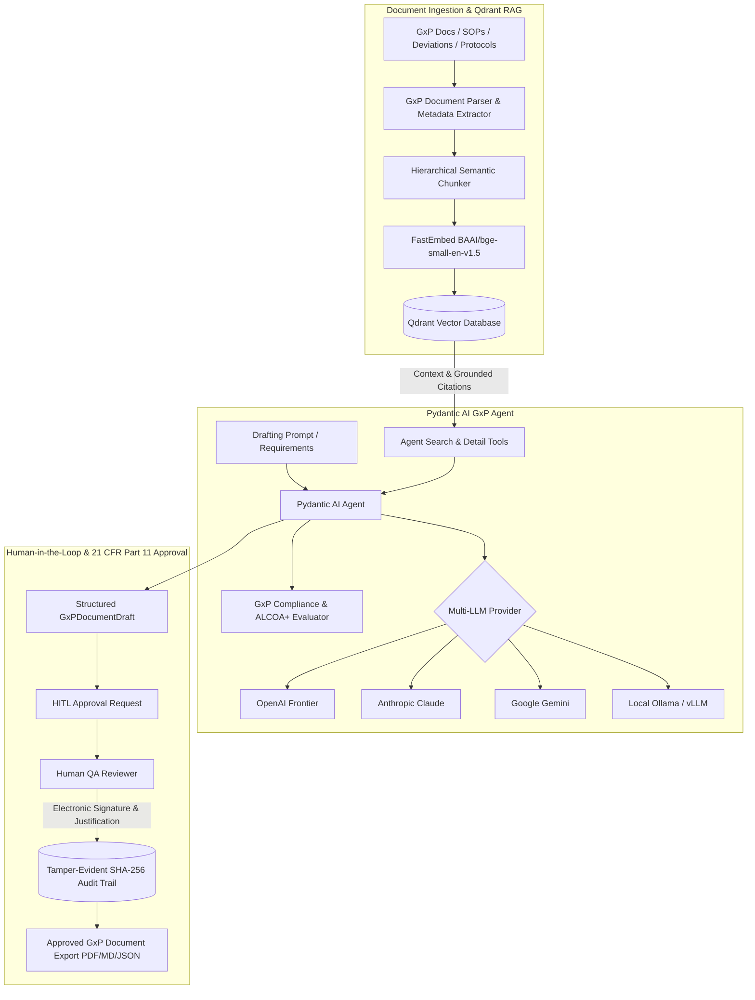

# AI GxP Document Draft Agent

[](https://www.python.org/downloads/)
[](https://ai.pydantic.dev/)
[](https://qdrant.tech/)
[]()
[](https://opensource.org/licenses/MIT)

An enterprise-grade, regulatory-compliant AI GxP Document Drafting System powered by **Pydantic AI**, **Qdrant Vector Database**, and a **21 CFR Part 11 / ALCOA+ compliant Human-in-the-Loop (HITL) approval workflow**.

---

## Key Features

1. **GxP Knowledge Base with Qdrant RAG**:
   - Multi-format document ingestion: **PDF**, **DOCX**, **Markdown**, **Text**, and **JSON**.
   - Automatic classification: SOPs, Work Instructions, Deviation Reports, Validation Protocols (IQ/OQ/PQ), CAPAs, Change Controls, and Batch Production Records.
   - Fast, local embedding generation via ONNX **FastEmbed** (no external embedding API key required, zero latency).
   - High-performance Qdrant vector retrieval with payload indexing and metadata filtering.

2. **Pydantic AI Agent Architecture**:
   - Strongly-typed Pydantic schemas enforcing ALCOA+ data integrity rules.
   - Mandatory **Grounded Citation Provenance**: Every procedural step, limit, and acceptance criterion cites its source document, section, and exact quote.
   - Granular procedural step generation with Critical Process Parameters (CPPs) and observable pass/fail criteria.
   - Automated compliance verification report card with ALCOA+ scoring (0-100%).

3. **Human-in-the-Loop (HITL) & 21 CFR Part 11 Compliance**:
   - Pausable lifecycle with deferred tool execution (`DeferredToolRequests`).
   - Legally-binding Electronic Signatures: Printed name, user role, signature meaning declaration, contemporaneous UTC timestamp, and SHA-256 digest.
   - Tamper-evident, cryptographically chained SHA-256 audit trail log.

4. **Local Langfuse Observability & Tracing**:
   - Out-of-the-box support for local Langfuse (`http://localhost:3000` or cloud).
   - High-fidelity trace hierarchy with typed observations: `agent`, `retriever` (Qdrant semantic search), `generation` (Pydantic AI model execution), and `guardrail` (ALCOA+ evaluation).
   - Automated quality scoring (0–1.0) and 21 CFR Part 11 Electronic Signature event logging on traces.

5. **Multi-LLM Provider Support**:
   - **OpenAI**: `openai:gpt-4o`, `openai:o3-mini`, `openai:gpt-4.5-preview`
   - **Anthropic**: `anthropic:claude-3-7-sonnet-latest`, `anthropic:claude-3-5-sonnet-latest`, `anthropic:claude-3-opus-latest`
   - **Google**: `google:gemini-2.0-flash`, `google:gemini-1.5-pro`
   - **Local / Ollama**: `ollama:llama3.3`, `ollama:qwen2.5:72b`, `ollama:deepseek-r1` or custom OpenAI-compatible endpoints (vLLM, Groq, LocalAI)
   - **Resilience**: Automatic provider fallbacks via `FallbackModel` and deterministic `TestModel`.

5. **Full-Stack Web Application & Rich CLI**:
   - Interactive Studio Dashboard with real-time draft generation, Qdrant collection manager, chunk inspector, e-signature sign-off dialog, and audit trail verifier.
   - Terminal CLI for scripting, continuous integration, and batch ingestion.

---

## Architecture Diagram



---

## Installation & Setup

### Prerequisites
- Python 3.10+
- [uv](https://github.com/astral-sh/uv) (recommended) or standard `pip`

### Install Dependencies
```bash
# Clone repository
git clone https://github.com/example/gxp-rag.git
cd gxp-rag

# Create virtual environment and install in editable mode
uv venv --python python3.12
source .venv/bin/activate
uv pip install -e ".[dev]"
```

### Environment Configuration (Optional)
Set your preferred API keys or configure local Ollama:
```bash
# Frontier LLM API Keys (pick your provider)
export OPENAI_API_KEY="sk-..."
export ANTHROPIC_API_KEY="sk-ant-..."
export GEMINI_API_KEY="..."

# Local Ollama / vLLM endpoint (default: http://localhost:11434/v1)
export OLLAMA_BASE_URL="http://localhost:11434/v1"

# Local Langfuse Observability (default: http://localhost:3000)
export LANGFUSE_HOST="http://localhost:3000"
export LANGFUSE_PUBLIC_KEY="pk-lf-..."
export LANGFUSE_SECRET_KEY="sk-lf-..."
export ENABLE_LANGFUSE="true"

# Default Model Selection
export GXP_LLM_MODEL="openai:gpt-4o"  # or "anthropic:claude-3-7-sonnet-latest", "ollama:llama3.3", "test"
```

---

## Quickstart

### 1. Ingest Sample GxP Documents into Qdrant
```bash
# Index sample SOPs, deviations, and validation protocols
gxp-rag ingest ./sample_data
```

### 2. Search the Knowledge Base
```bash
gxp-rag search "autoclave biological indicator lethality"
```

### 3. Draft a GxP Document via CLI
```bash
gxp-rag draft "Draft an SOP for Cleanroom Disinfection after microbial excursion in ISO Class 5 filling suite" --type SOP --model openai:gpt-4o
```

### 4. Start the Web Studio
```bash
gxp-rag serve --port 8000
```
Open your browser at **`http://localhost:8000`** to access the GxP Drafting Studio, Knowledge Base Manager, and Human Approval Center.

---

## Web Studio Capabilities

- **📄 Drafting Studio**: Select document type, model provider, and enter requirements. View the live structured draft with grounded source citations and an ALCOA+ compliance report card.
- **📚 Knowledge Base**: Drag & drop PDF/DOCX/MD files to automatically chunk, embed, and index them into Qdrant. Test queries in the semantic search sandbox and inspect vector chunks.
- **✍️ Human Approvals (HITL)**: Inspect pending drafts side-by-side with RAG citations, provide review comments, and execute legally-binding 21 CFR Part 11 Electronic Signatures.
- **🛡️ 21 CFR Part 11 Audit Trail**: View immutable audit event records with real-time SHA-256 cryptographic chain integrity verification.

---

## Running the Automated Test Suite

```bash
pytest -v
```

All 16 tests cover:
- Pydantic AI agent tool calls and structured output validation (`GxPDocumentDraft`)
- In-memory Qdrant RAG ingestion, semantic chunking, and similarity search
- 21 CFR Part 11 electronic signature generation and SHA-256 hash chaining
- Multi-provider model resolution (OpenAI, Anthropic, Gemini, Ollama, FallbackModel, TestModel)
- FastAPI REST API endpoints and template rendering

---

## License

MIT License.
